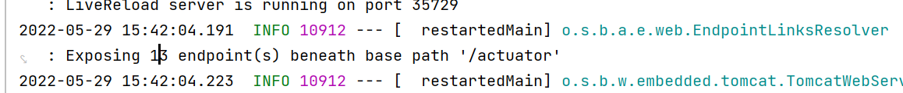

1. By using `Actuators` we can monitor and manage the application
* What is the health of the application?
* How many beans loaded into the application?
* What configuration properties loaded to the application?
* What is the heap info of the application?
* How many threads are running in the application?
* How many URL mappings are available in the application?

2. Add following dependency to enable actuators

* maven
```
<!-- https://mvnrepository.com/artifact/org.springframework.boot/spring-boot-starter-actuator -->
<dependency>
    <groupId>org.springframework.boot</groupId>
    <artifactId>spring-boot-starter-actuator</artifactId>
</dependency>
```
* Gradle
```
// https://mvnrepository.com/artifact/org.springframework.boot/spring-boot-starter-actuator
implementation group: 'org.springframework.boot', name: 'spring-boot-starter-actuator'
```

3. start the application and hit the following end point
``` 
http://localhost:9093/actuator/actuator 
```

4. To access the actuator end points use the following
```
http://localhost:9093/actuator/actuator/{endPoint}
```

5. By default, only `/health` endpoint is enabled in actuators.
```
http://localhost:9093/actuator/actuator/health 
```

6. To enable other end points add the following line in the **application.properties** file
```
management.endpoints.web.exposure.include=beans,health
```

> **Note :** to enable all end points use * like below
``` 
management.endpoints.web.exposure.include=*
```

then 13 end points will be exposed under actuators to confirm those 13 end points use the following link

```
http://localhost:9093/actuator/actuator
```

7. End point Details:

End point | Info
----------|---------
/beans | Shows all the beans loaded in the application
/mappings | Shows all the available Url-mappings of the application 
/health | Health status of the application
/configProps | Configuration properties loaded by the application
/metrics | Gives the metrics of the application
/loggers | Shows the application logs
/threaddump | Shows the threads information in the application
/heapdump | It will **download a file** with heap information

8. If we want to exclude a particular end point in actuators then
```
management.endpoints.web.exposure.exclude={endPoint}
Example : management.endpoints.web.exposure.exclude=health,mappings
```
> **Note :** all the above end points are **GET** Methods

9. we can shut down the application using actuators
``` 
management.endpoint.shutdown.enabled=true
```
> **Note :** shutdown is **POST** Method